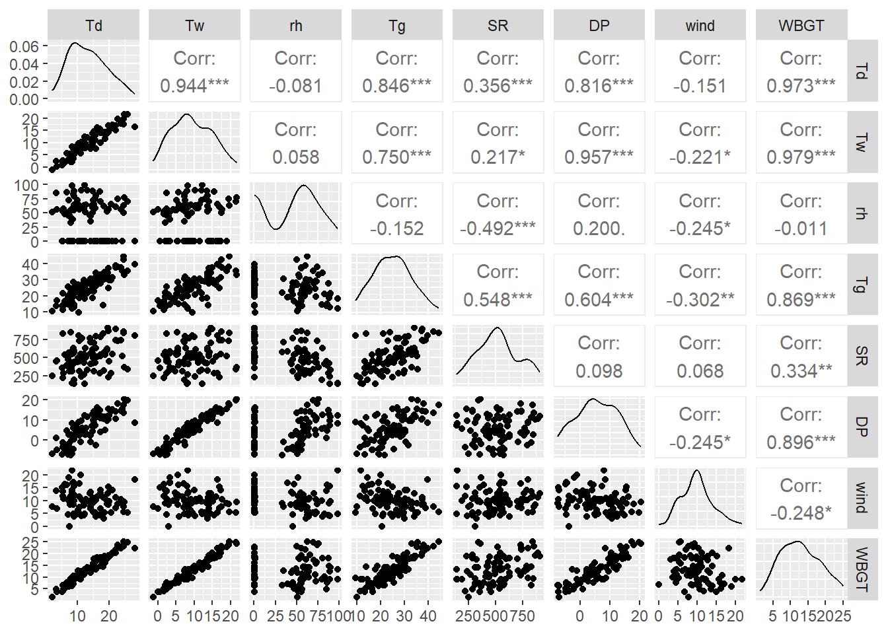
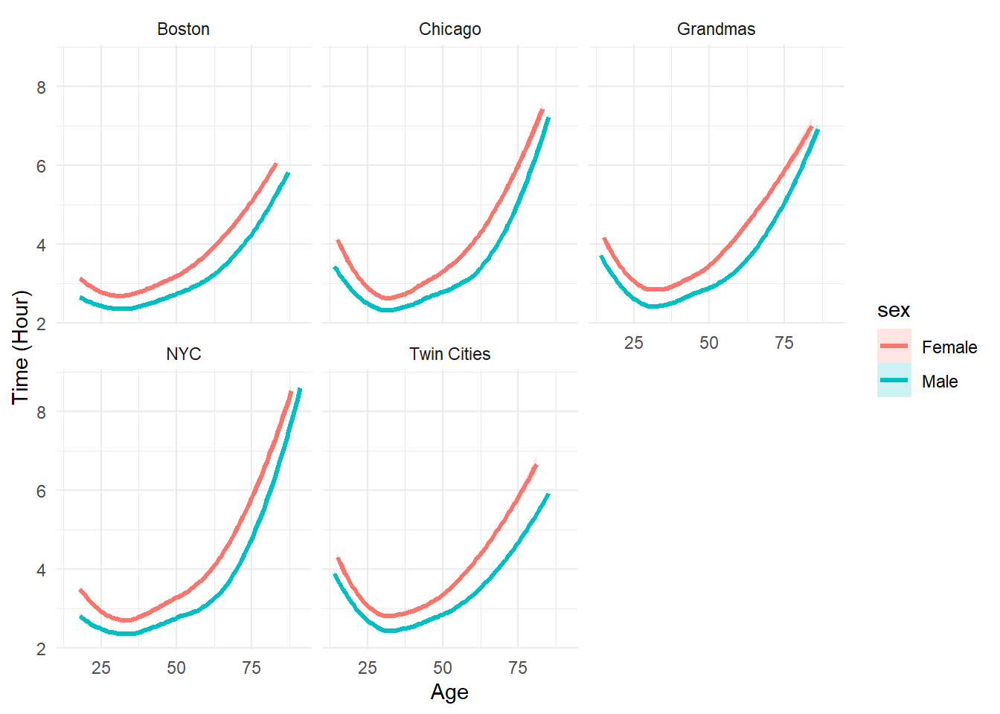
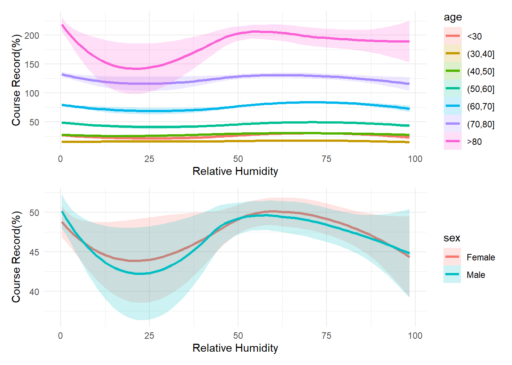

# Exploring the Relationship between Environmental Conditions and Marathon Performances

## Abstract

Past research revealed significant differences in marathon performance influenced by gender, age. Meanwhile, age may influence thermoregularization as well. We therefore designated to explore the impact of environmental conditions on marathon performances, including weather and air quality. Exploratory data analysis and linear regression were employed to verify the influence of weather conditions and air quality on marathon performances. We also identified relative humidity and WBGT may have have the largest impact on marathon performance.

## Methods

We began with exploratory data analysis (EDA) to examine the relationships between weather conditions and marathon performance. Pearson correlation coefficients were calculated for continuous variables (e.g., WBGT, relative humidity, solar radiation, wind speed).

We used linear regression to assess the impact of weather variables and air quality on marathon completion times. The dependent variable was completion time, and the independent variables included weather conditions, age, and sex, along with interaction terms. Stepwise selection was applied to refine the model.

## Results
We found that while male and female runners performed differently, with men finishing faster, weather conditions affected both genders similarly, suggesting physiological differences rather than sensitivity to weather. Weather had varying effects across age groups, with WBGT having the strongest impact on completion times, supporting previous findings on aerobic performance in hot conditions. Relative humidity and solar radiation also affected performance, while wind speed showed a unique age-dependent effect. Older runners seemed more sensitive to wind conditions due to reduced thermoregulatory and cardiovascular function.

The analysis supports the concept of a “prescriptive zone” for temperature regulation during exercise, where performance declines when environmental conditions exceed this zone. However, limitations include the exclusion of factors like training status and health, and the small sample sizes in the youngest and oldest age groups. Future research should incorporate these factors and ensure more balanced representation across age groups.

These findings suggest that race organizers should consider age-specific weather guidelines, and runners should adapt strategies based on weather forecasts, particularly WBGT. Future studies could aim to develop models predicting performance changes based on individual and environmental factors.

## Files
### report
`project1.Rmd`: The Rmarkdown version of the Project 1 report, which includes both written text interpretations and raw code used in the analysis. 

`project1.pdf`: The PDF version of the Project 1 report, which includes both written text interpretations and a Code Applendix with the code used in the analysis. 

## Dependencies

The following packages were used in this analysis: 

 - Data Manipulation: `tidyverse`, `reshape2`, `mice`, `glmnet` 
 - Table Formatting: `gtsummary`, `knitr`, `kableExtra`
 - Data Visualization: `ggplot2`, `pROC`, `patchwork`
