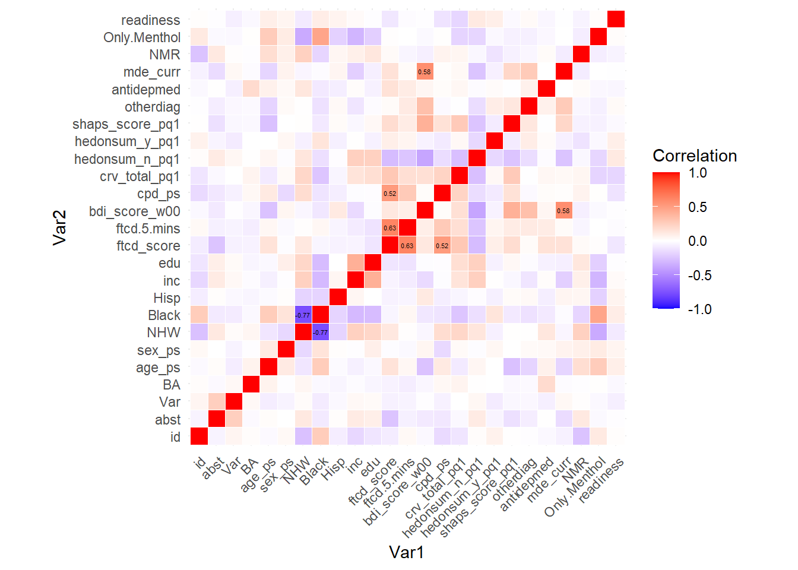
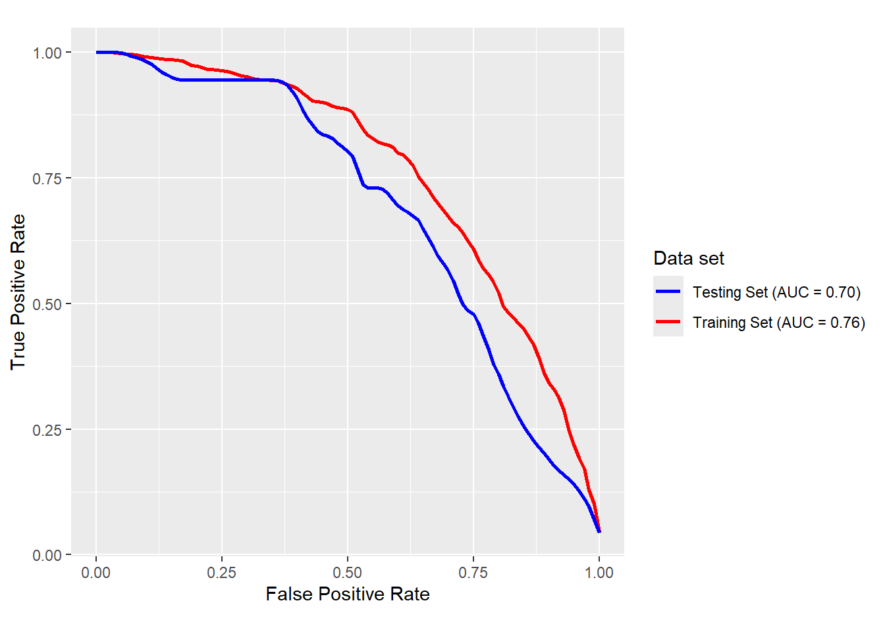

# Regression Analysis on Smoking Cessation

### Background
Smoking cessation is particularly challenging for adults with Major Depressive Disorder (MDD), who face compounded risks from both smoking and depression. Behavioral activation for smoking cessation (BASC) has shown potential in improving cessation outcomes, but its effectiveness is not yet clear. This study aims to identify baseline variables that moderate treatment effects or predict smoking cessation success in MDD patients, using data from a randomized, placebo-controlled trial comparing BASC and standard treatment with varenicline versus placebo.

### Methods
To identify potential predictors of smoking cessation, we performed variable selection using both Lasso regression and stepwise logistic regression. Lasso regression (with cross-validation) was applied to a model that included baseline variables, using the `glmnet` package to perform regularization and select variables based on their contribution to predicting abstinence. Stepwise logistic regression was used to identify significant predictors of smoking cessation by iteratively adding and removing variables based on the Akaike Information Criterion (AIC), allowing for a more traditional approach to variable selection. Both models were applied to control for treatment and pharmacotherapy effects while exploring interactions among baseline characteristics.

### Results
Our findings suggest that several baseline variables are important in influencing smoking cessation outcomes. Lasso regression identified nicotine metabolism as a moderator of pharmacotherapy effects, while stepwise regression revealed that education moderates the effects of psychotherapy. In terms of predictors, stepwise regression identified pharmacotherapy use, non-Hispanic white ethnicity, nicotine metabolism, and smoking habits upon waking as significant, while lasso regression detected only the latter behavior as a key predictor.

## Files
### report
`project2.Rmd`: The Rmarkdown version of the Regression Analysis report, which includes both written text interpretations and raw code used in the analysis. 

`project2.pdf`: The PDF version of the Regression Analysis report, which includes both written text interpretations and a Code Applendix with the code used in the analysis. 

## Dependencies

The following packages were used in this analysis: 

 - Data Manipulation: `tidyverse`, `reshape2`, `mice`, `glmnet` 
 - Table Formatting: `gtsummary`, `knitr`, `kableExtra`
 - Data Visualization: `ggplot2`, `pROC`, `patchwork`
